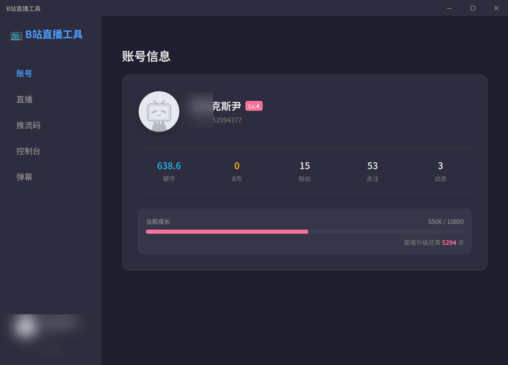
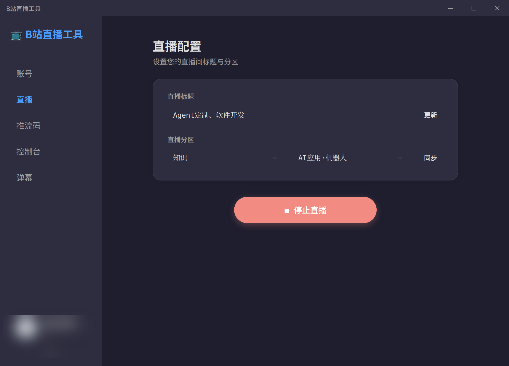
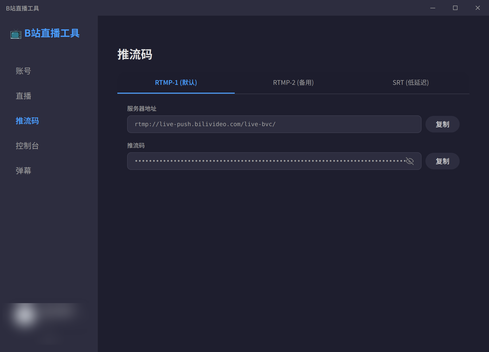
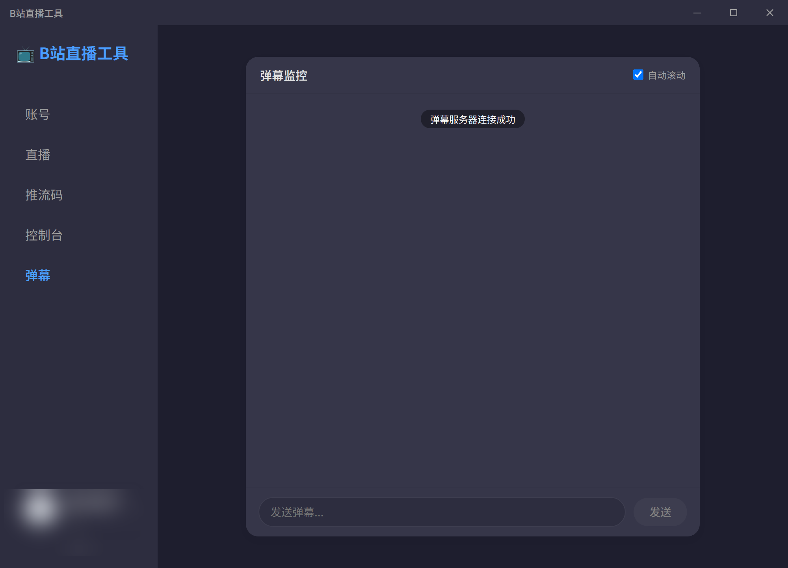

<!--
SPDX-License-Identifier: Apache-2.0
-->
# 📺 Bilibili 直播工具

> 📌 本仓库是 [ChaceQC/bilibili_live_stream_code](https://github.com/ChaceQC/bilibili_live_stream_code) 的复刻分支，在原版基础上增加了 Wayland 适配、深色模式、多平台构建等改进。衷心感谢原作者的出色工作。

<div align="center">


**获取 B 站直播推流码、管理直播、监控弹幕的一站式桌面工具**

[快速开始](#-快速开始) • [功能截图](#-功能截图) • [使用说明](#-使用说明) • [从源码构建](#-从源码构建) • [贡献指南](#-贡献指南)

</div>

## ✨ 功能

- **获取推流码** — 自动获取 RTMP / SRT 推流地址和推流码，配合 OBS 等软件直播，无需 B 站直播姬
- **弹幕监控** — 实时查看弹幕、进场消息、礼物消息，支持发送弹幕
- **直播管理** — 开播时自定义标题和分区，支持多账户切换
- **跨平台** — 支持 Windows、macOS (Intel + Apple Silicon)、Linux (amd64 + arm64)
- **深色模式** — 自动跟随系统主题

## 📸 功能截图

| 账号面板 | 直播设置 | 推流码 | 弹幕监控 |
|:---:|:---:|:---:|:---:|
|  |  |  |  |
| 查看用户信息、经验 | 设置直播标题与分区 | 获取 RTMP/SRT 推流码 | 实时弹幕与发送 |

## 🚀 快速开始

### 下载预构建版本

从 [GitHub Releases](https://github.com/wsyb/bilibili_live_stream_code/releases) 下载对应平台的安装包：

| 平台 | 架构 | 格式 |
|------|------|------|
| Windows | amd64 | `Setup.exe` |
| macOS (Intel) | amd64 | `.dmg` |
| macOS (Apple Silicon) | arm64 | `.dmg` |
| Linux | amd64 | `.AppImage` / `.deb` |
| Linux | arm64 | `.AppImage` / `.deb` |

### 从源码运行

```bash
# 克隆仓库
git clone https://github.com/wsyb/bilibili_live_stream_code.git
cd bilibili_live_stream_code

# 构建前端
cd frontend
npm install
npm run build
cd ..

# 安装后端依赖
pip install -r requirements.txt

# 运行
python main.py
```

> 详细构建步骤见 [从源码构建](#-从源码构建)。

## 📖 使用说明

1. **扫码登录** — 启动后扫码登录 B 站账号
2. **设置直播** — 填写标题、选择分区（首次使用先点击**同步**）
3. **开始直播** — 点击「开始直播」按钮
4. **获取推流码** — 在「推流码」面板复制推流地址和推流码到 OBS 等工具
5. **弹幕互动** — 在「弹幕」面板查看实时弹幕并发送消息
6. **结束直播** — 点击「停止直播」或关闭软件

> ⚠️ **注意**：在 OBS 中停止推流**不会**停止 B 站直播，需要在工具中点击「停止直播」。

## 🛠️ 从源码构建

### 环境要求

| 工具 | 最低版本 |
|------|---------|
| Python | 3.12+ |
| Node.js | 18+ |

### 完整构建步骤

#### 1. 克隆仓库

```bash
git clone https://github.com/wsyb/bilibili_live_stream_code.git
cd bilibili_live_stream_code
```

#### 2. 构建前端

```bash
cd frontend
npm install
npm run build
cd ..
```

#### 3. 安装后端依赖

```bash
pip install -r requirements.txt
pip install pyinstaller Pillow
```

**Linux 依赖**：从源码运行推荐安装 PyGObject（可选，用于托盘图标）：

```bash
pip install PyGObject
```

> 如果启动时提示 `Qt platform plugin "xcb" could not be found`，请安装：
> ```bash
> sudo apt install libxcb-xinerama0 libxcb-cursor0 libnss3
> ```

#### 4. 打包为可执行文件

**Windows**：
```bash
pyinstaller main.py --name BiliLiveTool --onefile --add-data "frontend/dist;frontend/dist" --icon "bilibili.ico" --noconsole
```

**macOS**：
```bash
pyinstaller main.py --name BiliLiveTool --onefile --add-data "frontend/dist:frontend/dist" --icon "bilibili.icns" --hidden-import _cffi_backend --windowed
```

**Linux**：
```bash
pyinstaller main.py --name BiliLiveTool --onefile \
  --add-data "frontend/dist:frontend/dist" \
  --add-data "bilibili.ico:." \
  --icon "bilibili.png" \
  --hidden-import _cffi_backend \
  --hidden-import cffi \
  --hidden-import qtpy \
  --hidden-import PyQt5 \
  --hidden-import webview.platforms.qt
```

构建产物位于 `dist/` 目录。

## 🏗️ 技术栈

| 层级 | 技术 |
|------|------|
| **前端 GUI** | Vue 3 + Vite |
| **桌面壳** | PyWebView (Qt5 / QtWebEngine) |
| **后端** | Python 3.12+ (aiohttp, requests) |
| **弹幕协议** | Protobuf (B 站直播) |
| **打包** | PyInstaller |

## 📁 项目结构

```
├── main.py                 # 应用入口
├── backend/                # Python 后端
│   ├── api_service.py      # API 服务
│   ├── bilibili_api.py     # B 站 API 封装
│   ├── config.py           # 配置管理
│   ├── data.py             # 数据模型
│   ├── services/           # 业务服务
│   │   ├── auth_service.py
│   │   ├── danmu_service.py    # 弹幕服务
│   │   ├── live_service.py     # 直播服务
│   │   ├── user_service.py     # 用户服务
│   │   └── window_service.py   # 窗口通信
│   ├── dm.proto            # 弹幕 Protobuf 定义
│   ├── state.py            # 会话状态
│   └── util.py             # 工具函数
├── frontend/               # Vue 3 前端
│   ├── src/
│   │   ├── components/     # UI 组件
│   │   ├── api/bridge.js   # 前后端桥接
│   │   └── styles/         # 主题样式
│   └── vite.config.js
├── packaging/              # 平台打包配置
│   ├── linux/
│   └── windows/
├── docs/                   # 文档
├── requirements.txt        # Python 依赖
└── pyproject.toml          # 项目元数据
```

## 🤝 贡献

欢迎提交 Issue 和 Pull Request！

请阅读 [CONTRIBUTING.md](CONTRIBUTING.md) 了解开发流程和代码规范。

## 📄 许可证

本项目基于 [Apache License 2.0](LICENSE.txt) 开源。

```
Copyright 2026 wsyb

Licensed under the Apache License, Version 2.0 (the "License");
you may not use this file except in compliance with the License.
You may obtain a copy of the License at

    http://www.apache.org/licenses/LICENSE-2.0
...
```

## ⭐ Star 历史

[](https://starchart.cc/ChaceQC/bilibili_live_stream_code)

---

## 🙏 致谢

- [ChaceQC](https://github.com/ChaceQC) — 原版项目的作者，感谢其出色的基础工作
- [Zeppelinpp/bilibili-streamer](https://github.com/Zeppelinpp/bilibili-streamer) — 基于 Tauri 2.x (Rust) + React 18 的重构版本，补全了 macOS 适配

> **维护者文档**：CI/CD 配置和构建问题详见 [HANDOVER.md](HANDOVER.md)
